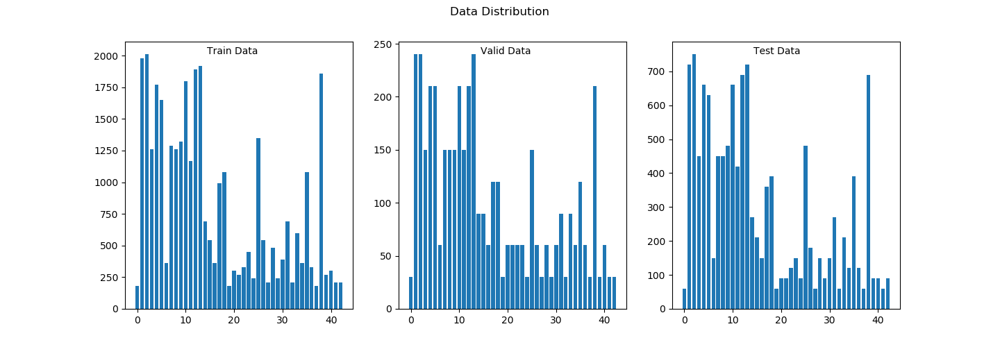
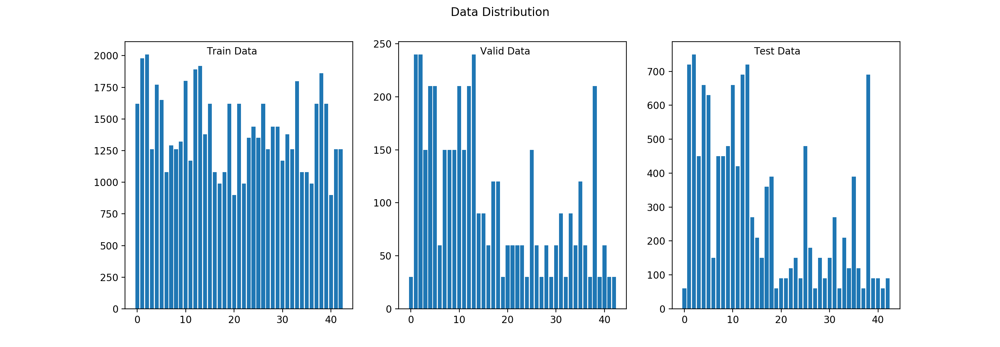
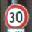
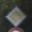
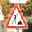
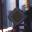

## Project: Build a Traffic Sign Recognition Program
[](http://www.udacity.com/drive)

Overview
---
In this project, I learned to apply convolutional neural networks (CNN) to images. 
I downloaded [German Traffic Sign Dataset](http://benchmark.ini.rub.de/?section=gtsrb&subsection=dataset) and trained LeNet network to classify them.
After the model was trained, I tested it on 11 images of the German traffic signs that I found on the web.
Unfortunately, those images turned out to be from the same dataset as Udacity, which I realized at the very end.

While working on the project I wrote it up in Python.  The code is in `main.py` which depends on `traffic_client_classifier.py` and `lenet5.py`.
After completing the project, I transferred the code to the [notebook](./Traffic_Sign_Classifier.ipynb), which you can find at the root of this repository.
I also exported the result of running the notebook as [report.html](./html_output/report.html).  Given how late I am and being pressed for time, I have decided not to re-run the
the training in the notebook.  The notebook was run on the *lenet* model I have saved while training in python shell.

This README is the required project writeup.

Data Set Summary & Exploration
---
I used the numpy library to calculate summary statistics of the traffic signs data set:
* size of training set is 34799
* size of the validation set is 4410*
* size of test set is 12630
* shape of a traffic sign image is (32, 32, 3)
* number of unique classes/labels in the data set is 43

#### Original Data


Design and Test a Model Architecture
---

Initially, I downloaded the dataset and used LeNet CNN discussed during the lectures to train on the images.  You can see the [code](./lenet5.py) in Lenet.lenet_lab function.  Training with this NN yielded only 90.9% accuracy
on the validation and test sets, which is below what was required for the project submission.  
Given that both test and validation set classification accuracies were very similar, I concluded that this was
not a case over overfitting.  I did try *dopout* and different normalization technique without any success.  

Per the project suggestions, I also augmented the data by rotating some images +/-15 deg and zooming out to 75%. 
I used scipy.ndimage library to dring the number images in the training set to 60477 (see `synthesize_data` in `helper_functions.py`).
The additional data were stored to and loaded from 2 additional pickles 
(_syn_train_zoom_rotate10.pickle_ and _syn_train_rotate15.pickle_).  As a result, the data became a bit less biased.

#### Augmented Data


Data augmentation did not improve the classification accuracy significantly.  After this, I concluded that I am dealing 
with underfitting.  Therefore, I went ahead and doubled the number of layers in LeNet.  The final net has 4 convolution,
 3 fully connected, and 1 output NN layer.  
 
My final model consisted of the following layers:

| Layer         		|     Description	        					| 
|:---------------------:|:---------------------------------------------:| 
| Input         		| 32x32x3 RGB image   							| 
| Convolution 3x3     	| 1x1 stride, VALID padding, outputs 30x30x6 	|
| RELU					|												|
| Convolution 5x5     	| 1x1 stride, VALID padding, outputs 26x26x16 	|
| RELU					|												|
| Max pooling	      	| 2x2 stride,  outputs 13x13x16 				|
| Convolution 3x3	    | 1x1 stride, VALID padding, 12x12x26       	|
| RELU					|												|
| Fully connected 1		| 1300x400        								|
| Fully connected 2		| 400x120        								|
| Fully connected 3		| 120x84        								|
| Logits/Output			|         									    |
|						|												|
|						|												|
 
I set the meta training parameters as follows:
EPOCHS = 20
BATCH_SIZE = 128
learning_rate = 0.001
        
The new architecture brought the validation set accuracy to 96% and the test set accuracy to 95.5%.  This result 
appears to be due to the increased network complexity allowing it to store more non-linear information about the 
traffic signs in the training set.

Here is the printout from training:
```
EPOCH 1 ...
Validation Accuracy = 0.861

EPOCH 2 ...
Validation Accuracy = 0.891

EPOCH 3 ...
Validation Accuracy = 0.927

EPOCH 4 ...
Validation Accuracy = 0.924

EPOCH 5 ...
Validation Accuracy = 0.944

EPOCH 6 ...
Validation Accuracy = 0.943

EPOCH 7 ...
Validation Accuracy = 0.945

EPOCH 8 ...
Validation Accuracy = 0.951

EPOCH 9 ...
Validation Accuracy = 0.952

EPOCH 10 ...
Validation Accuracy = 0.943

EPOCH 11 ...
Validation Accuracy = 0.943

EPOCH 12 ...
Validation Accuracy = 0.964

EPOCH 13 ...
Validation Accuracy = 0.970

EPOCH 14 ...
Validation Accuracy = 0.960

EPOCH 15 ...
Validation Accuracy = 0.952

EPOCH 16 ...
Validation Accuracy = 0.957

EPOCH 17 ...
Validation Accuracy = 0.957

EPOCH 18 ...
Validation Accuracy = 0.968

EPOCH 19 ...
Validation Accuracy = 0.966

EPOCH 20 ...
Validation Accuracy = 0.958

Model saved
INFO:tensorflow:Restoring parameters from ./lenet
Test Accuracy = 0.955
```

In the retrospect, I did waste a bit of time to arrive to this point.  I should have printed out the training 
set accuracy versus the validation set one.


Testing a Model on New Images
---

I looked for the test images on the web.  Unknowingly, I selected the same test set as the one that Udacity used.
I decided not to redo this part due to how late I am.  I did learn a bit even then.

These are 11 images I selected.  The format of the image name is _index_-_traffic sign class_.jpg 

    
    
  

The model classified 10 out of 11 images correctly, which is 90.9%.  Statistically, the set was too small.
I went ahead and printed out top 5 softmax probabilities in Logits layer.  Looking at 00001-1.jpg  I saw:
```
Softmax top5:  TopKV2(values=array([[  6.60421431e-01,   3.39578658e-01,   1.31344891e-09, 
3.79103114e-14,   1.91815846e-14]], dtype=float32), 
indices=array([[2, 1, 5, 3, 6]], dtype=int32))
```
          
Unlike the other correct predictions (see cell 14 in Notebook), the classifier was uncertain of the correct result in this case.
\#2 Speed limit (30km/h) has the probability 66% and \#1 (correct) Speed limit (50km/h) has probability at 33.95%.
The uncertainty in this case due to its inability to distionguish between 3 and 5 in the sign. 

Visualizing the Neural Network
---

In cell 13, I printed out the weight images of the 4 convolution layers.  I can see that there is room for improvement, as in
layer , Feature Maps 4, 5, 18, 21 do not carry any information.  _Dropout_ technique would have possibly helped to activate those layers.